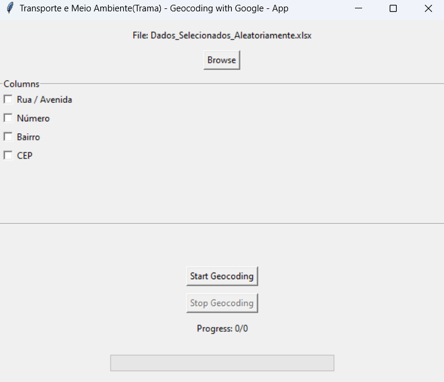

# geocode-with-google
## v2.0
### Automated Geocoding with Selenium, Pandas, and Tkinter Interface

This project enhances the process of automated geocoding by incorporating a graphical user interface (GUI), allowing for an interactive and user-friendly experience. Building upon the capabilities introduced in version 1.5, version 2.0 integrates a Tkinter-based interface to select input files and columns for geocoding directly through the GUI. It continues to use Google Maps via Selenium WebDriver for fetching latitude and longitude data for addresses found in an Excel spreadsheet. This version also maintains the caching mechanism to avoid redundant queries and includes detailed logging for monitoring and troubleshooting.



#### What's New in v2.0

- **Tkinter GUI**: Introduces a graphical user interface for enhanced user interaction, making it easier to select input files and specify columns for address data.
- **Dynamic Column Selection**: Users can now select the address columns directly from the interface using checkboxes, improving flexibility and ease of use.
- **Live Status Updates**: The GUI provides live status updates during the data preparation and geocoding process, enhancing transparency and user feedback.
- **Improved Design and Usability**: Adjustments to the interface design for better spacing, readability, and overall user experience.
- **Stop Geocoding Feature**: Adds the ability to interrupt the geocoding process, allowing users more control during execution.
- **Executable Version**: An executable version of the code has been created using PyInstaller and is available in the `dist` directory under the name `geocode-with-google-and-seleniumV2.exe`.

## Features

- **Selenium WebDriver**: Automates browser interactions to query Google Maps for geocoding.
- **Pandas**: Manages and updates Excel spreadsheets with geocoded data.
- **Tkinter GUI**: Offers a user-friendly interface for file selection and column configuration.
- **Caching**: Utilizes a caching system to minimize redundant geocoding queries.
- **Logging**: Detailed logging of the geocoding process to facilitate debugging.
- **Configurable Address Columns**: Users can select address columns via the GUI for flexible data handling.

## Requirements

To run this project, you need Python 3.6 or newer. All dependencies are listed in `requirements.txt`, including:

- Selenium
- Pandas
- Webdriver-Manager
- Tkinter (usually included with Python)

## Setup

1. **Clone the repository**:
    ```
    git clone https://your-repository-url
    cd your-repository-directory
    ```

2. **Create a virtual environment** (optional, but recommended):
    ```
    python -m venv venv
    source venv/bin/activate  # On Windows, use `venv\Scripts\activate`
    ```

3. **Install the requirements**:
    ```
    pip install -r requirements.txt
    ```

## Running the Application

Launch the application by executing:

python geocode-with-google-and-seleniumV2.py


Alternatively, you can run the executable version from the `dist` directory without needing to install Python or any dependencies:

./dist/geocode-with-google-and-seleniumV2/geocode-with-google-and-seleniumV2.exe

The GUI will prompt you to select an input Excel file and the address columns for geocoding. After configuration, click "Start Geocoding" to initiate the process. The application will update the selected output file with latitude, longitude, and processing status for each address.

## Contributing

Contributions are welcome to further enhance the application, address any issues, or improve its features. Feel free to submit pull requests or open issues in the repository.

## License

This project is open-source and available under the GNU General Public License (GPL) version 3, dated 29 June 2007. For more details, see the LICENSE file in the repository or visit [https://www.gnu.org/licenses/gpl-3.0.html](https://www.gnu.org/licenses/gpl-3.0.html).